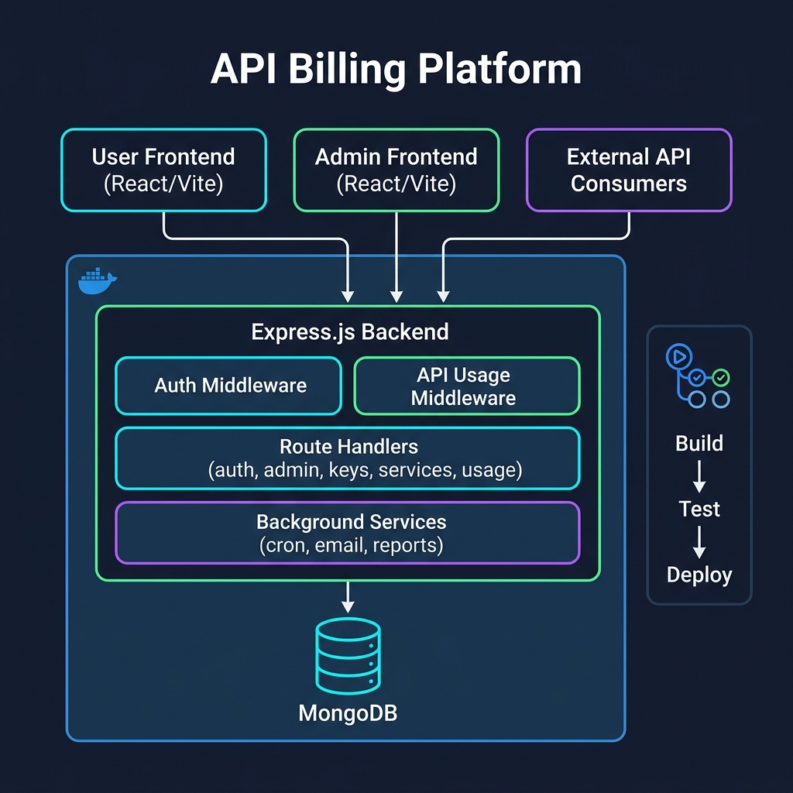
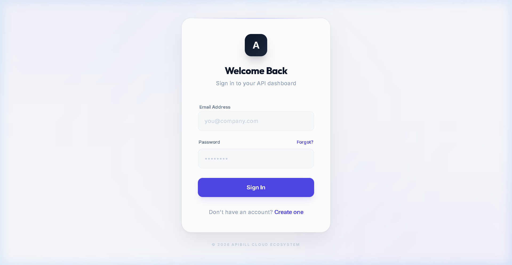
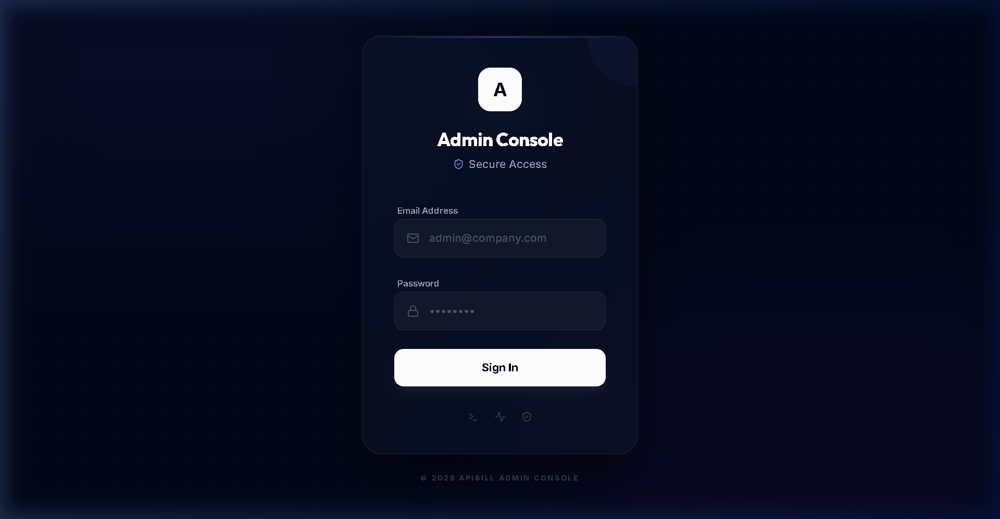

# 🚀 API Billing Platform

A full-stack **API Billing & Usage Analytics Platform** built with React, Express.js, and MongoDB — enhanced with a complete DevOps pipeline using GitHub Actions, Docker containerization, and automated CI/CD workflows.

---

## 📋 Problem Statement

Organizations that expose APIs need a centralized system to **manage API keys**, **track usage metrics** with geographic granularity, **enforce billing rates**, and **generate automated reports**. Without such a system, API providers face revenue leakage, untracked usage, and manual billing overhead.

This platform solves that by providing:
- Self-service API key management for developers
- Real-time usage analytics with region-based breakdown
- Role-based admin panel for rate management and user oversight
- Automated cron-based billing reports delivered via email

---

## 🏗️ Architecture Diagram



### System Components

```
┌─────────────────┐     ┌─────────────────┐     ┌─────────────────┐
│   User Frontend │     │  Admin Frontend  │     │  External APIs  │
│   (React/Vite)  │     │  (React/Vite)    │     │  (Consumers)    │
└────────┬────────┘     └────────┬─────────┘     └────────┬────────┘
         │                       │                         │
         │    ┌──────────────────┼─────────────────────────┘
         │    │                  │
    ┌────▼────▼──────────────────▼────┐
    │       Express.js Backend        │
    │  ┌──────────┐  ┌──────────────┐ │
    │  │   Auth   │  │  API Usage   │ │
    │  │Middleware │  │  Middleware  │ │
    │  └──────────┘  └──────────────┘ │
    │  ┌──────────────────────────┐   │
    │  │       Route Handlers     │   │
    │  │  auth │ admin │ services │   │
    │  │  keys │ usage │ superadm │   │
    │  └──────────────────────────┘   │
    │  ┌──────────────────────────┐   │
    │  │    Background Services   │   │
    │  │  cron │ email │ reports  │   │
    │  └──────────────────────────┘   │
    └────────────────┬────────────────┘
                     │
              ┌──────▼──────┐
              │   MongoDB   │
              │  (Mongoose) │
              └─────────────┘
```

---

## ⚙️ CI/CD Pipeline Explanation

We use **GitHub Actions** to automate the entire software delivery process. The pipeline is defined in `.github/workflows/ci.yml` and consists of **three stages**:

### Pipeline Flow

```
┌──────────┐     ┌──────────┐     ┌──────────┐
│  BUILD   │────▶│   TEST   │────▶│  DEPLOY  │
│          │     │          │     │          │
│ Install  │     │ Lint     │     │ Docker   │
│ deps     │     │ Syntax   │     │ Build    │
│ Build    │     │ Health   │     │ Push to  │
│ Frontend │     │ checks   │     │ Registry │
└──────────┘     └──────────┘     └──────────┘
```

### Stage Details

| Stage | What It Does | Trigger |
|-------|-------------|---------|
| **Build** | Installs dependencies (with npm caching), builds React frontends, uploads build artifacts | Every push & PR to `main` |
| **Test** | Runs ESLint on frontends, validates backend JS syntax (`node --check`), executes health check tests | After successful Build |
| **Deploy** | Builds Docker image, pushes to Docker Hub using GitHub Secrets | Only on push to `main` (not PRs) |

### Key Features
- **npm caching** — speeds up builds by caching `node_modules`
- **Conditional deployment** — deploy only runs on `main` branch, not on pull requests
- **Build artifact sharing** — frontend builds are uploaded and downloaded between jobs
- **Docker layer caching** — uses GitHub Actions cache for Docker builds

---

## 🌿 Git Workflow Used

We follow the **Feature Branch Workflow**:

```
main ─────────────────────────────────────────────▶
  │                                                 ▲
  └── feature/devops-enhancement ──── (commits) ────┘
                                        PR merge
```

### Workflow Steps
1. `main` branch holds the stable, production-ready code
2. Created `feature/devops-enhancement` branch for all DevOps work
3. Made **multiple meaningful commits** (Docker, CI/CD, tests, docs)
4. Opened a **Pull Request** from `feature/devops-enhancement` → `main`
5. Pipeline runs automatically on the PR
6. After review, merged into `main` → deploys automatically

### Branch Summary
| Branch | Purpose |
|--------|---------|
| `main` | Production-ready code |
| `feature/devops-enhancement` | DevOps pipeline, Docker, tests, documentation |

---

## 🛠️ Tools Used

| Tool | Purpose |
|------|---------|
| **GitHub Actions** | CI/CD pipeline automation |
| **Docker** | Containerization & deployment |
| **Docker Compose** | Multi-service orchestration (app + MongoDB) |
| **Node.js 18** | JavaScript runtime |
| **Express.js** | Backend REST API framework |
| **React 19 + Vite** | Frontend UI framework |
| **MongoDB + Mongoose** | Database & ODM |
| **Tailwind CSS** | Frontend styling |
| **JWT** | Authentication tokens |
| **GitHub Secrets** | Secure credential management |
| **npm caching** | Build optimization |
| **ESLint** | Code quality & linting |

---

## 📸 Screenshots

### ✅ CI/CD Pipeline Success
> *Screenshot of GitHub Actions pipeline showing all three stages (Build → Test → Deploy) passing:*

<!-- Add screenshot after first successful pipeline run -->


### 🚀 Deployment Output
> *Screenshot showing the deployed application running:*

<!-- Add screenshot of running application -->


### 🐳 Docker Container Running
> *Screenshot of Docker container running the application:*

<!-- Add screenshot of docker compose output -->


---

## 🔐 GitHub Secrets Configuration

The following secrets are configured in **GitHub → Settings → Secrets → Actions**:

| Secret | Purpose |
|--------|---------|
| `DOCKERHUB_USERNAME` | Docker Hub login username |
| `DOCKERHUB_TOKEN` | Docker Hub access token |
| `MONGO_URI` | MongoDB connection string |
| `JWT_SECRET` | JWT signing secret |

> ⚠️ **No credentials are hardcoded in the source code.** All sensitive values are stored in GitHub Secrets and injected at runtime.

---

## 📁 Project Structure

```
Api-billing-main/
├── .github/
│   └── workflows/
│       └── ci.yml              # CI/CD pipeline (Build → Test → Deploy)
├── backend/
│   ├── config/                 # Database configuration
│   ├── middleware/              # Auth & API tracking middleware
│   ├── models/                 # Mongoose schemas (User, APIKey, Service, Usage)
│   ├── routes/                 # Express route handlers
│   ├── services/               # Background services (cron, email, reports)
│   ├── tests/                  # Backend health check tests
│   ├── utils/                  # Shared constants, logger, validators
│   └── server.js               # Application entry point
├── frontend/                   # User-facing React application
├── admin-frontend/             # Admin panel React application
├── scripts/
│   └── test.sh                 # CI test runner script
├── docs/
│   └── architecture.png        # Architecture diagram
├── Dockerfile                  # Multi-stage Docker build
├── .dockerignore               # Docker build exclusions
├── docker-compose.yml          # Docker Compose orchestration
├── .gitignore                  # Git exclusions
└── README.md                   # This file
```

---

## 🏃 Getting Started

### Prerequisites

- **Node.js** >= 18.x
- **MongoDB** (local instance or MongoDB Atlas)
- **Docker** (optional, for containerized deployment)

### Local Development

```bash
# Install all dependencies
npm run install-all

# Start backend (from /backend)
cd backend && npm start

# Start user frontend (from /frontend)
cd frontend && npm run dev

# Start admin panel (from /admin-frontend)
cd admin-frontend && npm run dev
```

### Docker Deployment

```bash
# Build and run with Docker Compose
docker compose up --build

# Application available at: http://localhost:5000
```

### Running Tests

```bash
# Run backend health tests
npm test

# Run full CI test suite (Linux/macOS)
npm run test:ci
```

---

## 🧩 Challenges Faced

1. **Multi-stage Docker Build Complexity**  
   Building both React frontends and the backend in a single Dockerfile required careful ordering of COPY and RUN commands to maximize Docker layer caching.

2. **CI/CD Job Dependencies**  
   Ensuring the Test job correctly depends on Build, and Deploy depends on Test, while sharing build artifacts between jobs required using `actions/upload-artifact` and `actions/download-artifact`.

3. **Secrets Management**  
   Moving from hardcoded `.env` values to GitHub Secrets required restructuring how environment variables are injected in both local development and CI/CD contexts.

4. **Conditional Deployment**  
   Configuring the deploy job to only run on `main` branch pushes (not on PRs) using `if: github.ref == 'refs/heads/main'` prevented accidental deployments from feature branches.

5. **Frontend Build in CI**  
   Both Vite-based frontends needed their specific PostCSS/Tailwind dependencies installed correctly in the CI environment, which required careful dependency management.

---

## 📝 API Endpoints

### Authentication (`/api/auth`)
| Method | Endpoint | Description |
|--------|----------|-------------|
| POST | `/register` | Register a new user account |
| POST | `/login` | Authenticate and receive JWT |
| GET | `/me` | Get authenticated user profile |

### API Keys (`/api/keys`)
| Method | Endpoint | Description |
|--------|----------|-------------|
| POST | `/generate` | Generate a new API key |
| GET | `/` | List user's API keys |
| DELETE | `/:id` | Delete an API key |

### Usage Analytics (`/api/usage`)
| Method | Endpoint | Description |
|--------|----------|-------------|
| GET | `/` | Get raw usage records |
| GET | `/stats` | Get aggregated usage statistics |
| GET | `/region` | Get usage breakdown by region |

### Admin (`/api/admin`)
| Method | Endpoint | Description |
|--------|----------|-------------|
| GET | `/overview` | System overview statistics |
| GET | `/users` | User list with usage stats |
| PUT | `/keys/:id/rate` | Update API key billing rate |

---

## 📄 License

This project is part of an academic coursework submission.
